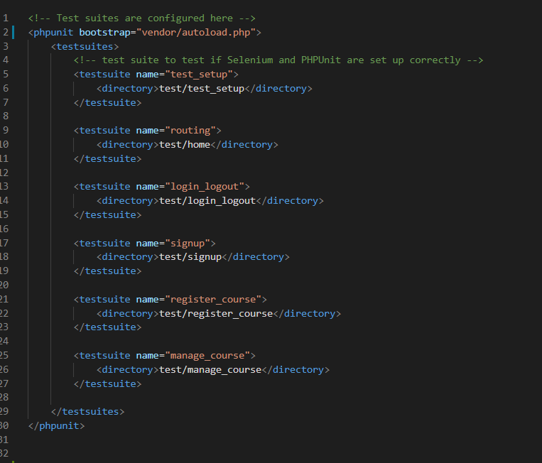

# Testing Guidelines

## Setting Up
- We have two folders:
  - `project`: contains the project's PHP source code and the test cases
  - `testing_setup`: contains the files required to run the Selenium server
- Install JDK (Java Development Kit) to run the Selenium server (Grid) (https://docs.oracle.com/javase/10/install/installation-jdk-and-jre-microsoft-windows-platforms.htm)
- Install composer for Xampp's PHP (https://thecodedeveloper.com/install-composer-windows-xampp/)
- Put composer.json file in `project` folder (they are development dependencies, so `require-dev` is more reasonable than `require`): 
```
{
    "require-dev": {
        "phpunit/phpunit":"^9",
        "phpunit/phpunit-selenium": "*",
        "php-webdriver/webdriver":"1.9.0"
    }
}
```
<i>Note: Remember to check the PHP version for compatible versions of the dependencies.</i>

- Install PHPUnit and Selenium WebDriver as project dependencies by running the following command (in the `project` folder):
```
composer update
```
<i>Note: When rolling out to production, run the following command to avoid installing the development dependencies</i>
```
composer update --no-dev
```

- Download the Selenium webdrivers for different browsers (https://www.lambdatest.com/blog/selenium-php-tutorial/#PHPWebDriver)
- Download the webdrivers and put them in the `testing_setup` folder<br>
<i>Note for Chrome ver 64: The file chromedriver_win32.zip also works for 64-bit Windows</i>
- Download the Selenium standalone server (https://selenium-release.storage.googleapis.com/3.141/selenium-server-standalone-3.141.59.jar) and put it in the `testing_setup` folder
- After setting up, the `project`  folder should look like this
<br><br>

<br><br>
- After setting up, the `testing_setup` folder should look like this
<br><br>

<br><br>
<i>Note: In the figure above, there are two webdrivers for two browsers: Chrome, Firefox</i>

## Writing the test cases
- Create a folder named `test` in the `project` folder. This is where we store the test cases written in PHP.
- Test cases should be grouped into test suites. Define the test suites in `phpunit.xml`. Each test suite corresponds to a seperate folder inside `test`. The `test` folder should look like this.
<br><br>

<br><br>
And the `phpunit.xml` looks something like this
<br><br>

<br><br>
- Start writing test cases :^)<br>
<i>Note: In the `test/test_setup` folder, there are test cases named `GoogleSearchxxxxTest.php` where xxxx is the browser's name. Execute these test cases first to check if the setup is correct. PHPUnit should output something like this</i>
<br><br>

<br><br>

## Executing the test cases
- First, run the Selenium server using the following command (run the command in the `testing_setup` folder):
```
java -jar selenium-server-standalone-3.141.59.jar
```
- Run a specific test case using the following command (run the command in the `project` folder):
```
.\vendor\bin\phpunit --debug .\test\xxxxTest.php
```
where `xxxxTest.php` is the php file contained in `test` folder corresponding to the test case you want to run.
- Run a test suite using the following command (run the command in the `project` folder):
```
.\vendor\bin\phpunit --testsuite <name of test suite>
```
For example,
```
.\vendor\bin\phpunit --testsuite test_setup
```


# Notes
- PHPUnit identifies test files by their names. A test file should be named xxxxTest.php. For example, LoginTest.php, SearchTest.php, ... Other names are <strong>invalid</strong>.
- A test method should be named testxxx. For example,
```
public function test_Login () {
    ...
}
```
Other methods are using the `@test` annotation in the method’s docblock or calling the method explicitly (not reccommended) (see [2] for more details).
- There are 8 locators which are supported by Selenium. Read more about them at https://www.lambdatest.com/blog/locators-in-selenium-webdriver-with-examples/


# References
[1] https://thecodedeveloper.com/install-composer-windows-xampp/<br>
[2] https://www.lambdatest.com/blog/selenium-php-tutorial/<br>
[3] https://phpunit.de/getting-started/phpunit-9.html<br>
[4] https://docs.oracle.com/javase/10/install/installation-jdk-and-jre-microsoft-windows-platforms.htm<br>
[5] https://www.guru99.com/desired-capabilities-selenium.html<br>
[6] https://www.lambdatest.com/blog/locators-in-selenium-webdriver-with-examples/<br>
[7] https://stackoverflow.com/questions/33016300/selenium-change-language-browser-chrome-firefox<br>
[8] https://github.com/php-webdriver/php-webdriver<br>
[9] https://github.com/sebastianbergmann/phpunit/commit/80754cf323fe96003a2567f5e57404fddecff3bf<br>
